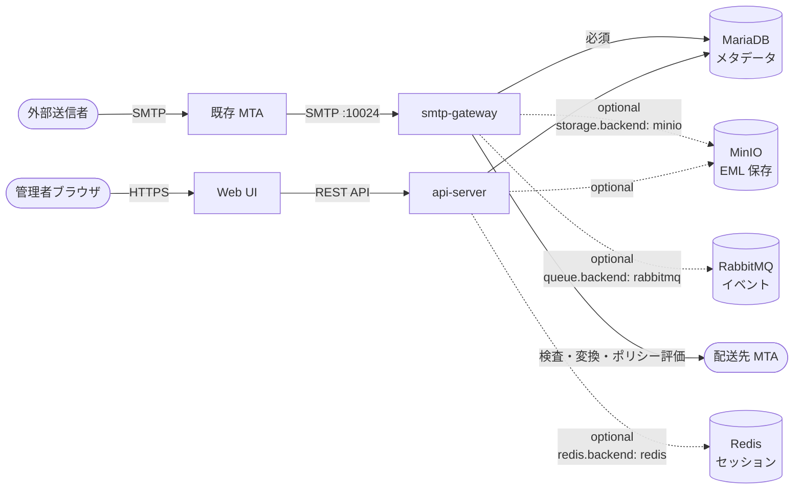

# MailShield OSS

受信メールゲートウェイのミドルウェア。外部MTAから届いたメールを検査・変換・ポリシー評価したうえで配送・隔離・拒否を行う。

## 特徴

- **プラグイン型ワーカー**: 検査ワーカー（並列）と変換ワーカー（直列）を設定ファイルで有効化・無効化できる
- **マルチルート**: `mailshield.yaml` の `routes:` で受信・送信を1ファイルに定義。正規表現でルートを振り分ける
- **MTA非依存**: Postfix・Sendmail・外部MTAを問わず、SMTP after-queue content filter として動作する
- **MariaDB のみ必須**: RabbitMQ・MinIO・Redis はすべてオプション。`queue.backend: none` / `storage.backend: filesystem` / `redis.backend: mariadb` で外部サービスなしの単一ノード構成にできる
- **管理 Web UI**: メール一覧・隔離管理・添付ファイル分離・ユーザー管理・監査ログ・API キー管理を Web ブラウザで操作できる
- **API キー認証**: `Authorization: Bearer <key>` ヘッダで機械間認証。CI/CD・SIEM 連携に使用できる

## クイックスタート

詳細な手順は [クイックスタートガイド](docs/setup/quick-start.md) を参照してください。
**2パターンあります。用途に合わせて選んでください。**

### パターン A: 開発・動作確認（組み込み MTA を使う）

Postfix + Mailpit を含めてまとめて起動します。

```bash
# 1. クローン
git clone https://github.com/koizumib/mailshield.git
cd mailshield

# 2. .env を作成し、CHANGE_ME_ の4箇所のパスワードを変更
cp .env.example .env

# 3. 起動
make dev-up

# 4. テストメール送信
swaks --to test@internal.test --from sender@external.test \
      --server localhost --port 25 \
      --header "Subject: Hello MailShield"

# Mailpit でメールを確認
open http://localhost:8025
```

### パターン B: 自前 MTA と組み合わせる（全機能テスト・本番に近い構成）

```bash
# 1. クローン・.env 作成（パスワード + MAILSHIELD_REINJECT_HOST を変更）
cp .env.example .env

# 2. config/mailshield.yaml の trusted_sources とルートドメインを変更
# 3. config/api-server.yaml の frontend_url と storage.public_endpoint を変更
# 4. 起動（ClamAV・Tika・Web UI 含む全機能）
COMPOSE_PROFILES=storage,queue,scanners,api docker compose up -d

# 5. Web UI にアクセス
open http://localhost:3000
```

デフォルトの管理者アカウント（`infra/mariadb/init/002_seed.sql` で設定）:
- メールアドレス: `admin@example.com`
- パスワード: `password`

## ドキュメント

### セットアップ
| ドキュメント | 内容 |
|------------|------|
| [システム概要と前提アーキテクチャ](docs/setup/overview.md) | **まず読む** — 必要な MTA・インフラ要件 |
| [クイックスタート](docs/setup/quick-start.md) | Docker Compose で最速起動 |
| [プロファイルガイド](docs/setup/profiles.md) | Docker Compose プロファイルの組み合わせ |
| [自前 MTA との連携](docs/setup/mta-self-managed.md) | Postfix 等の既存 MTA への組み込み方法 |
| [バイナリインストール](docs/setup/binary-install.md) | Docker を使わないセットアップ |
| [アップグレード](docs/setup/upgrade.md) | バージョンアップ手順 |

### ユーザーガイド
| ドキュメント | 内容 |
|------------|------|
| [ルーティング設定](docs/guide/routes.md) | inbound / outbound ルートの定義方法 |
| [ポリシー設定](docs/guide/policy.md) | ポリシーエンジンのルール記述方法 |
| [ワーカー設定](docs/guide/workers.md) | 組み込みワーカーの設定・有効化 |
| [隔離メール管理](docs/guide/quarantine.md) | 隔離の解放・削除・一括操作 |

### 開発者向け
| ドキュメント | 内容 |
|------------|------|
| [Lua カスタムワーカー](docs/development/custom-worker-lua.md) | Lua でワーカーを実装する方法 |
| [Go 組み込みワーカー](docs/development/custom-worker-go.md) | Go でワーカーをビルドインする方法 |
| [REST API リファレンス](docs/development/api-reference.md) | 全エンドポイントの仕様 |
| [テストガイド](docs/development/testing.md) | ユニットテスト・E2E テストの実行方法 |

### 運用
| ドキュメント | 内容 |
|------------|------|
| [トラブルシューティング](docs/operations/troubleshooting.md) | よくある問題と解決策 |
| [バックアップ・リストア](docs/operations/backup.md) | MariaDB と MinIO のバックアップ手順 |

### 技術仕様
| ドキュメント | 内容 |
|------------|------|
| [アーキテクチャ概要](docs/architecture.md) | システム全体の構成とデータフロー |
| [設定リファレンス](docs/specs/configuration.md) | mailshield.yaml / api-server.yaml / 環境変数の全設定項目 |
| [ログ仕様](docs/specs/logging.md) | ログフォーマット・フィールド定義・syslog 切替方法 |
| [シグナルハンドリング](docs/specs/signals.md) | SIGTERM / SIGINT / SIGHUP の動作 |
| [メール処理フロー](docs/specs/mail-processing-flow.md) | メール1通が辿るステップの詳細・隔離解放フロー |
| [ワーカー仕様](docs/specs/workers.md) | 組み込みワーカー・Lua ワーカーの実装仕様 |
| [ストレージ仕様](docs/specs/storage.md) | MinIO オブジェクトパス命名規則 |
| [キュー仕様](docs/specs/queues.md) | RabbitMQ Exchange・キュー設計 |
| [API 認証仕様](docs/specs/api-authentication.md) | セッション Cookie / API キー認証の詳細 |
| [設計判断記録](docs/decisions/) | ADR（Architecture Decision Records） |

## 開発コマンド

```bash
make dev-up     # フル構成起動（Postfix + Mailpit + Web UI）
make core-up    # コアのみ起動（smtp-gateway + インフラ）
make dev-down   # 停止

# smtp-gateway（Go サービス）
cd services/smtp-gateway
go test ./...               # 全テスト
go test ./... -v            # 詳細出力
go build ./cmd/server/      # ビルド

# api-server（Go サービス）
cd services/api-server
go test ./...
go build ./cmd/server/
```

## コンポーネント構成



詳細は [アーキテクチャ概要](docs/architecture.md) を参照。
