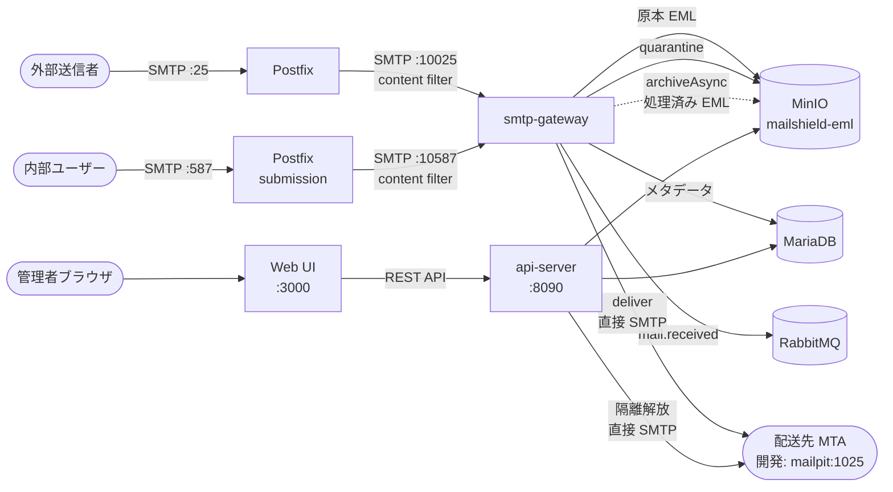

# アーキテクチャ概要

## 位置付け

MailShield は SMTP **after-queue content filter** として動作する。外部MTAから受け取ったメールを独自パイプラインで処理し、ポリシー評価の結果に応じて配送・隔離・拒否を行う。

受信と送信は**同一バイナリ（smtp-gateway）**が処理する。`mailshield.yaml` の `routes:` セクションで正規表現によるルート振り分けを定義し、ルートごとにワーカーとポリシーを切り替える。



## コンポーネント

### smtp-gateway（Go）

受信・送信の両方を担う単一サービス。起動時に読み込む `mailshield.yaml` の `routes:` で動作を切り替える。

| ルート名（設定例） | ポート | 用途 |
|-----------------|------|------|
| `inbound` | 10025 | 受信フィルタリング（RCPT TO が内部ドメイン宛て） |
| `outbound` | 10587 | 送信 DLP・コンテンツフィルタ（MAIL FROM が内部ドメイン） |

**direction による テナント解決の分岐:**
- `direction: inbound` → `To:` ドメインでテナントを解決
- `direction: outbound` → `From:` ドメインでテナントを解決

**処理ステップ（7ステップ）:**
1. メール受信・接続元ホワイトリスト検証
2. MinIO に原本 EML 保存（`{tenant}/raw/YYYY/MM/DD/{uuid}.eml`）
3. MariaDB にメタデータ記録
4. RabbitMQ に `mail.received` 発行
5. 検査パイプライン（並列）
6. 変換パイプライン（直列）
7. ポリシー評価・アクション実行

**`deliver` アクションの配送先:**
Postfix を経由せず、`policy.yaml` の `destination` フィールドに指定した SMTP エンドポイントへ直接接続して送信する。開発環境では `mailpit:1025`。

**隔離即時通知:**
`quarantine` アクション決定時、`quarantine_notification.enabled: true` の場合は受信者（To: アドレス）に非同期で通知メールを送信する。

### api-server（Go）

REST API サーバー。管理 Web UI のバックエンドとして動作する。

| エンドポイント群 | 説明 |
|--------------|------|
| `GET/POST /api/v1/auth/*` | ログイン・ログアウト・セッション管理・パスワードリセット |
| `GET /api/v1/stats` | ダッシュボード統計 |
| `GET /api/v1/messages/*` | メール一覧・詳細・EML ダウンロード（署名付き URL） |
| `GET/POST/DELETE /api/v1/quarantine/*` | 隔離メール管理・解放・削除・一括操作 |
| `GET/PATCH/DELETE /api/v1/attachments/*` | 分離済み添付ファイル管理 |
| `GET/POST /api/v1/public/attachments/*` | 認証不要の添付ファイルダウンロード（OTP 認証） |
| `GET/POST/PATCH/DELETE /api/v1/users/*` | ユーザー管理（admin のみ） |
| `GET/POST/PATCH/DELETE /api/v1/mailboxes/*` | メールボックス管理・割り当て |
| `GET /api/v1/audit-logs` | 監査ログ一覧（admin のみ） |
| `GET/POST/DELETE /api/v1/api-keys/*` | API キー管理（admin のみ） |

**認証方式:**
Cookie セッションを優先し、Cookie がなければ `Authorization: Bearer <api_key>` ヘッダで認証する。API キーは SHA-256 ハッシュで DB に保存され、平文は発行時のみ返す。

**隔離解放フロー:**
api-server が MinIO から処理済み EML を取得し、`config/api-server.yaml` の `notification.reinject_host:reinject_port` へ直接 SMTP 送信する。

### Postfix（MTA・スコープ外）

MailShield のスコープ外だが Docker Compose にオプション同梱。

| 役割 | 詳細 |
|------|------|
| 受信（:25） | 外部からのメールを受け取り、content_filter として smtp-gateway へ転送する |
| キューイング | 一時的な障害時に自動リトライする |
| TLS 終端 | 外部 → Postfix 間の TLS 処理 |

### インフラ

| コンポーネント | 用途 | 切替可否 |
|--------------|------|---------|
| MinIO | 原本EML・処理済みEML・添付ファイルの保存 | 外部S3へ切替可能 |
| MariaDB 11 | メッセージメタデータ・テナント・ユーザー・検査結果・監査ログ・API キー | 外部DBへ切替可能 |
| RabbitMQ | ワーカー間イベントバス（`mail.received` 発行） | 外部AMQPへ切替可能 |
| Redis | セッション・キャッシュ・レート制限 | 外部へ切替可能 |
| ClamAV | ウイルス検査エンジン（av-worker が使用） | docker-compose.yml scanners profile |
| Apache Tika | ドキュメント解析・DLP（dlp-worker が使用） | docker-compose.yml scanners profile |
| Mailpit | 開発用メール確認（デフォルト配送先） | - |

## ワーカーの種類

### 検査ワーカー（InspectWorker）

- 原本EMLを**読むだけ**。内容を変更しない
- 全ワーカーが**並列**に実行される
- 結果は `InspectResult{Score, Detected, Details}` として返す
- 設定で有効・無効・タイムアウトを制御する

### 変換ワーカー（TransformWorker）

- EMLの内容を**書き換える**
- 設定ファイルの `order` 順に**直列**実行される
- 各ワーカーは前ワーカーの出力 Mail を受け取る
- 設定で有効・無効・実行順序を制御する

## ポリシーエンジン

検査結果の集計スコアと変換後のメールを受け取り、YAMLルールに従ってアクションを決定する。

アクションの種類:
- `deliver`: `policy.yaml` の `destination` へ直接 SMTP 送信
- `reject`: 拒否（送信者へバウンス）
- `quarantine`: 隔離（MinIO に処理済み EML を保存、DB status=quarantined、通知メール送信）
- `approval`: 承認フロー保留（未実装）

## ディレクトリ構成

```
mailshield/
├── config/                          # ユーザーが編集する設定ファイル
│   ├── mailshield.yaml              # smtp-gateway 設定（routes で受信・送信を定義）
│   ├── api-server.yaml              # api-server 設定
│   ├── policy-inbound.yaml          # 受信ポリシールール
│   ├── policy-outbound.yaml         # 送信ポリシールール
│   └── workers/
│       └── conf/                    # ワーカー固有設定ファイル
├── docs/                            # ドキュメント
│   ├── architecture.md              # 本ドキュメント
│   ├── decisions/                   # ADR
│   └── specs/                       # 技術仕様
├── infra/                           # インフラ設定（コードなし）
│   ├── mariadb/init/                # 初期スキーマ・マイグレーション SQL
│   ├── minio/
│   ├── postfix/
│   ├── postfix-submission/
│   └── rabbitmq/
├── docker-compose.yml               # 全サービス（profiles で組み合わせ）
├── Makefile
├── services/
│   ├── smtp-gateway/                # Go サービス（受信・送信共通）
│   │   ├── cmd/server/              # エントリーポイント（DI のみ）
│   │   └── internal/
│   │       ├── config/
│   │       ├── domain/              # 型・インターフェース定義（外部依存ゼロ）
│   │       ├── notify/              # 隔離通知メール送信
│   │       ├── pipeline/            # 検査・変換パイプライン
│   │       ├── policy/              # ポリシーエンジン
│   │       ├── queue/               # RabbitMQ アダプター
│   │       ├── repository/          # DB アダプター
│   │       ├── smtp/                # SMTP サーバー
│   │       ├── storage/             # MinIO アダプター
│   │       └── worker/              # ワーカー登録・管理
│   │           └── builtin/         # 組み込みワーカー
│   └── api-server/                  # Go サービス（REST API・管理 Web UI バックエンド）
│       ├── cmd/server/
│       └── internal/
│           ├── audit/               # 監査ログ記録（非同期・best-effort）
│           ├── auth/                # 認証（Standalone / OIDC）
│           ├── config/
│           ├── domain/
│           ├── handler/             # HTTP ハンドラー
│           ├── middleware/          # 認証ミドルウェア（Cookie / API キー）
│           ├── otp/                 # OTP（ワンタイムパスワード）管理
│           ├── pwreset/             # パスワードリセットトークン管理
│           ├── repository/          # DB アダプター
│           └── storage/             # MinIO アダプター
└── web/                             # React フロントエンド（Vite + TypeScript）
    └── src/
        ├── pages/                   # 画面コンポーネント
        ├── hooks/                   # TanStack Query カスタムフック
        ├── components/              # 共通 UI コンポーネント
        └── lib/                     # API クライアント・ユーティリティ
```

## パッケージ依存ルール

```
internal/domain/    外部依存ゼロ。型とインターフェースのみ定義する
internal/*/         domain/ のインターフェースに依存する。相互依存禁止
cmd/server/main.go  DI のみ。ビジネスロジックを書かない
```
