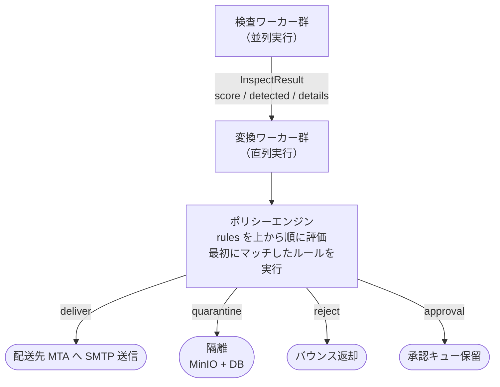

# ポリシー設定ガイド

MailShield のポリシーエンジンは、検査ワーカーの結果をもとにメールの処理を決定します。
ルールは YAML ファイルで定義し、ルートごとに別々のファイルを指定できます。

---

## 仕組み



---

## ファイルの場所

ポリシーファイルはルートディレクトリに配置します。
`route.yaml` と同じディレクトリの `policy.yaml`（および `policy.lua`）が自動的に読み込まれます。

```
config/routes.d/
├── 10-inbound/
│   ├── route.yaml
│   └── policy.yaml   ← 受信ルートのポリシー
└── 20-outbound/
    ├── route.yaml
    └── policy.yaml   ← 送信ルートのポリシー
```

---

## ルールの書き方

```yaml
# config/routes.d/10-inbound/policy.yaml
rules:
  - name: av_detected          # ルール名（ログに記録される）
    condition: "av-worker.detected == true"
    action: quarantine

  - name: dlp_high_score
    condition: "dlp-worker.score >= 80"
    action: quarantine

  - name: default_deliver      # フォールバック（必ず最後に置く）
    condition: "true"
    action: deliver
    destination: "postfix:10025"
```

---

## アクション

| アクション | 説明 |
|-----------|------|
| `deliver` | `destination` で指定した MTA へ SMTP 送信する |
| `quarantine` | メールを隔離する。受信者に即時通知メールを送信（設定による） |
| `reject` | 送信者にバウンスを返す |
| `approval` | 承認キューに保留する。承認者はメールボックスの admin 割り当て（優先）→ ユーザー個人の `approver_id` → `approval.global_approver_email` の順で解決される（詳細: [設定リファレンスの approval](../specs/configuration.md#approval)） |

### `deliver` の `destination`

`destination` には **deliverer 名**（`mailshield.yaml` の `deliverers` で定義）または **host:port** を指定できる。名前が優先して解決される。

```yaml
action: deliver
destination: "sendgrid"          # deliverer 名（deliverers.sendgrid を使用。STARTTLS + AUTH 可）
destination: "postfix:10025"     # ホスト:ポート（平文 SMTP）
destination: "mailpit:1025"      # 開発環境（Mailpit）
destination: "10.0.0.1:25"       # IP 指定
destination: "postfix"           # ポート省略時は :25（同名の deliverer があればそちらが優先）
```

`destination` を省略した場合は `deliverers.default` が使われる。`deliverers.default` が未定義なら `reinject.host:port` にフォールバックする。

ルールごとに deliverer を分けられるため、「outbound ルートの通常メールは SendGrid、社内向けは Postfix」のような振り分けができる:

```yaml
rules:
  - name: internal_relay
    condition: "header-worker.internal == true"
    action: deliver
    destination: "postfix"        # deliverers.postfix
  - name: default_send
    condition: "true"
    action: deliver
    destination: "sendgrid"       # deliverers.sendgrid（STARTTLS + SMTP AUTH）
```

SendGrid / Amazon SES 等の外部 SMTP エンドポイントの定義方法は [設定リファレンスの deliverers](../specs/configuration.md#deliverers) を参照。

---

## 条件式（condition）

条件は 1 行で書きます。`&&`（論理積）で複数の比較をつなげられます。OR は複数のルールに分けて表現します（上から評価され最初にマッチしたルールが採用されるため）。

### 演算子

| 演算子 | 例 | 説明 |
|--------|-----|------|
| `true` / `false` | `condition: "true"` | 定数（デフォルトルールに使う） |
| `==` / `!=` | `av-worker.detected == true` | 等値・不等（ブールは大文字小文字を無視） |
| `>=` `>` `<=` `<` | `dlp-worker.score >= 80` | 数値比較 |
| `contains` | `mail.subject contains 請求書` | 部分文字列（大文字小文字を無視） |
| `in_list` | `mail.from_domain in_list freemail` | 名前付きリストに含まれるか（下記） |
| `&&` | `A == 1 && B >= 50` | 論理積 |

### 名前付きリスト（lists）と `in_list`

`in_list` で参照する集合を policy.yaml のトップレベル `lists` に定義します。インライン（`values`）と外部ファイル（`file`・policy.yaml からの相対パス・1 行 1 要素・`#` はコメント）を併用でき、和集合になります。

```yaml
lists:
  freemail:
    file: ../../lists/freemail-domains.txt   # 同梱のフリーメールドメイン一覧
    values: [example-free.test]              # 追加のインライン要素
  deny_domains:
    values: [evil.example, phishing.test]

rules:
  # 個人ドメイン（フリーメール）宛の送信は上長承認へ
  - name: freemail_to_approval
    condition: "mail.direction == outbound && mail.to_domains in_list freemail"
    action: approval

  # 拒否ドメイン宛はブロック
  - name: deny_domain_block
    condition: "mail.to_domains in_list deny_domains"
    action: reject
```

`in_list` はメールアドレス（`@` を含む値）の場合、そのドメイン部でも照合します。

### 合算スコア（total_score）

全検査ワーカーの `score` の合計が `total_score` として使えます。個々のワーカーでは閾値に届かない複合的な兆候をまとめて判定する（Mail Detox 的な運用）のに使います。

```yaml
- name: suspicious_total
  condition: "total_score >= 100"
  action: quarantine
```

---

## 条件式のキー

### ワーカー由来（`{ワーカー名}.{フィールド}`）

| キー | 型 | 説明 |
|-----|---|------|
| `{worker}.detected` | bool | 検知フラグ |
| `{worker}.score` | int (0–100) | スコア |
| `total_score` | int | 全ワーカーの score 合計 |

ワーカー別の `details` キーの例:

| キー | ワーカー | 説明 |
|-----|---------|------|
| `av-worker.virus_name` | av-worker | 検知ウイルス名 |
| `header-inspector.reason` | header-inspector | 検知理由 |
| `url-worker.matched_url` | url-worker | マッチした URL |
| `attachment-inspector.reasons` | attachment-inspector | 検知理由の一覧 |

### メール属性（`mail.*`）

| キー | 型 | 説明 |
|-----|---|------|
| `mail.from` | string | エンベロープ送信者アドレス（小文字） |
| `mail.from_domain` | string | 送信者のドメイン部（小文字） |
| `mail.to` | string | 全宛先をカンマ連結（小文字） |
| `mail.to_domains` | string | 全宛先のドメインをカンマ連結（小文字） |
| `mail.subject` | string | 件名 |
| `mail.size_bytes` | int | メールサイズ（バイト） |
| `mail.has_attachment` | bool | 添付の有無 |
| `mail.direction` | string | `inbound` / `outbound` |

> [!NOTE]
> `mail.to` / `mail.to_domains` は宛先が複数の場合カンマ連結された1つの文字列です。
> 「宛先のいずれかがフリーメール」を判定するには `in_list`（アドレス/ドメイン単位で照合）を使ってください。

---

## ルート別ポリシーの使い方

受信と送信で異なるポリシーを設定する典型例:

```yaml
# config/routes.d/10-inbound/policy.yaml（受信）
rules:
  - name: virus
    condition: "av-worker.detected == true"
    action: quarantine

  - name: default
    condition: "true"
    action: deliver
    destination: "mail.example.com:10025"
```

```yaml
# config/routes.d/20-outbound/policy.yaml（送信）
rules:
  - name: dlp_block
    condition: "dlp-worker.score >= 80"
    action: quarantine

  - name: default
    condition: "true"
    action: deliver
    destination: "mail.example.com:10025"
```

---

## 注意事項

- ルールは **上から順に評価**し、最初にマッチしたルールで処理が終わる
- `condition: "true"` は必ずフォールバックとして最後に置く（ないとマッチしない場合にメールが消える）
- ワーカーが無効（`enabled: false`）の場合、そのワーカーのキーは facts に存在しない → 条件が `false` になる
- `destination` のホスト名は Docker ネットワーク内のサービス名を直接使用できる
