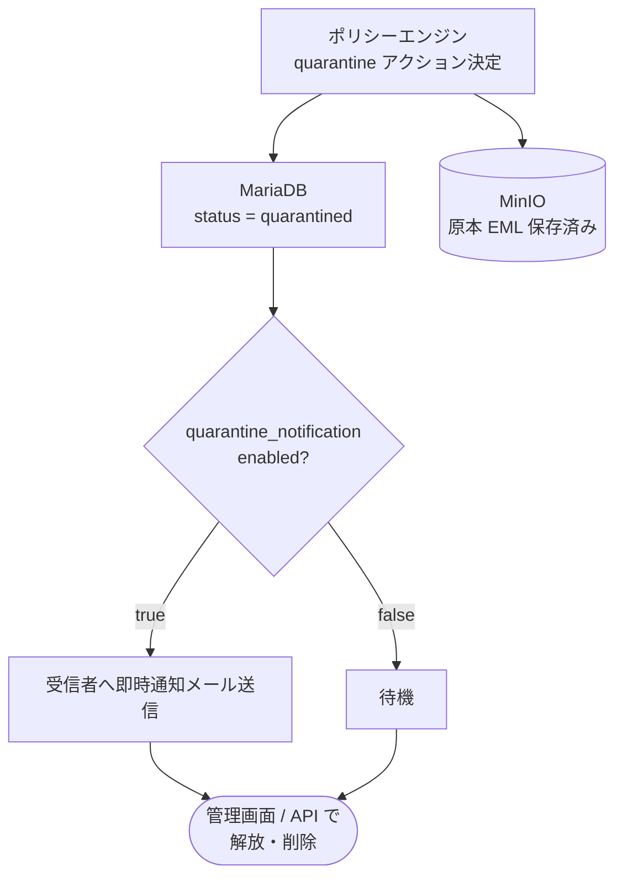

# 隔離メール管理ガイド

ポリシーエンジンが `quarantine` アクションを決定したメールは隔離キューに保存されます。Web UI と REST API から管理できます。

---

## 隔離の仕組み



---

## アクセス権限

| 操作 | 必要なロール |
|-----|------------|
| 隔離一覧の閲覧 | viewer, operator, admin |
| 解放（1件） | viewer, operator, admin（可視性フィルタによる） |
| 削除（1件） | operator, admin |
| 一括解放 | operator, admin |
| 一括削除 | operator, admin |

**可視性フィルタ:** ユーザーが閲覧できる隔離メールは、そのユーザーが割り当てられたメールボックスへの
メールに限定されます。admin は全件を閲覧できます。

---

## Web UI での操作

`http://localhost:3000/quarantine` から管理画面にアクセスします。

### 1件ずつ操作

- 一覧から行をクリック → 詳細画面
- **解放:** メールを `destination` に再配送する。EML は MinIO から取得して SMTP 送信
- **削除:** DB のステータスを `deleted` に変更（MinIO の EML は保持）

### 一括操作

- 一覧のチェックボックスで複数選択
- 「N件を解放」「N件を削除」ボタンで一括処理（最大100件）

---

## API での操作

認証は `Authorization: Bearer <api_key>` または セッション Cookie を使います。

### 隔離一覧取得

```bash
GET /api/v1/quarantine?page=1&limit=20&direction=inbound
```

クエリパラメータ:

| パラメータ | 説明 |
|-----------|------|
| `page` | ページ番号（デフォルト 1） |
| `limit` | 1ページあたりの件数（デフォルト 20） |
| `direction` | `inbound` / `outbound`（省略時は全件） |
| `from` | 送信者アドレスでフィルタ |
| `to` | 受信者アドレスでフィルタ |

### 1件解放

```bash
POST /api/v1/quarantine/{id}/release
```

成功すると `status: "delivered"` に更新されます。

### 1件削除

```bash
DELETE /api/v1/quarantine/{id}
```

### 一括解放

```bash
POST /api/v1/quarantine/bulk-release
Content-Type: application/json

{"ids": ["uuid1", "uuid2", "uuid3"]}
```

最大 100 件。部分成功（一部失敗した場合もレスポンスで各 ID の結果を返す）。

### 一括削除

```bash
DELETE /api/v1/quarantine/bulk
Content-Type: application/json

{"ids": ["uuid1", "uuid2"]}
```

---

## 即時通知メールの設定

隔離が発生した際に受信者へ通知メールを送信できます。

```yaml
# config/mailshield.yaml
quarantine_notification:
  enabled: true
  ui_base_url: "https://mailshield.example.com"   # 通知メール内のログイン URL
```

通知メールには「MailShield にログインして確認する」リンクが含まれます。
通知メールから直接解放するリンクは含まれません（ログインが必要）。

---

## 隔離されたメールの確認

```bash
# 隔離一覧をAPIで確認
curl -H "Authorization: Bearer <api_key>" \
     http://localhost:8081/api/v1/quarantine | jq .

# EML 原本のダウンロード（operator/admin のみ）
curl -H "Authorization: Bearer <api_key>" \
     http://localhost:8081/api/v1/messages/{id}/eml \
     -o quarantined.eml
```
