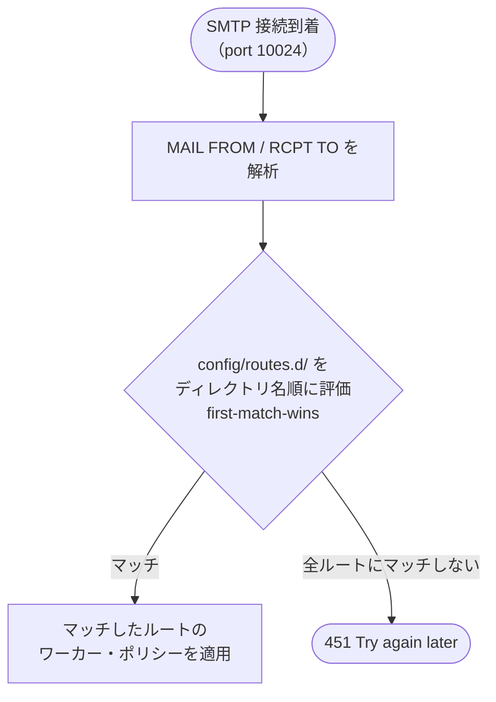

# ルーティング設定ガイド

MailShield は受信・送信の区別をルート定義で行います。
MAIL FROM / RCPT TO の正規表現で動的に判定し、ルートごとに異なるワーカーとポリシーを適用できます。

---

## 仕組み



---

## 設定の場所

ルートは `config/routes.d/` 配下の個別ディレクトリで定義します。
`config/mailshield.yaml` にルートは記述しません。

```
config/routes.d/
├── 00-bounce/          # バウンス（MAIL FROM:<>）ルート
│   ├── route.yaml      # ルート定義（match / workers）
│   └── policy.yaml     # アクション定義
├── 10-inbound/         # 受信ルート
│   ├── route.yaml
│   ├── policy.yaml
│   └── policy.lua      # Lua 拡張ルール（任意）
└── 20-outbound/        # 送信ルート
    ├── route.yaml
    └── policy.yaml
```

ディレクトリ名の数字プレフィックスが評価順序を決めます（小さい方が先）。
同じメールが複数のディレクトリにマッチした場合、最初にマッチしたルートだけが適用されます（first-match-wins）。

### route.yaml の形式

```yaml
# config/routes.d/10-inbound/route.yaml
name: inbound           # ルート名（ログに記録される）
direction: inbound      # inbound / outbound / internal
match:
  to: "@example\\.com$"   # RCPT TO を評価する正規表現
  to_match: any            # any: 宛先の1つでもマッチ / all: 全員マッチ
workers:
  inspect:
    - name: av-worker
      enabled: true
      timeout_seconds: 30
  transform:
    - name: sanitize-worker
      enabled: true
      order: 1
# policy は同ディレクトリの policy.yaml / policy.lua を自動参照する
```

`policy:` キーは不要です。`policy.yaml`（および存在する場合は `policy.lua`）は
同じディレクトリにあるファイルが自動的に読み込まれます。

### policy.yaml の形式

```yaml
# config/routes.d/10-inbound/policy.yaml
rules:
  - name: av_detected
    condition: "av-worker.detected == true"
    action: quarantine

  - name: default_deliver
    condition: "true"
    action: deliver
    destination: "mail.example.com:10025"
```

---

## ルートパラメータ

### `name`

ルートの識別名。ログや統計に記録されます。

### `direction`

| 値 | 意味 |
|---|------|
| `inbound` | 外部 → 内部ドメイン（受信） |
| `outbound` | 内部ドメイン → 外部（送信） |
| `internal` | 内部 → 内部 |

添付ファイルのダウンロード認証方式（`attachment_download.flows`）は `direction` の値で振り分けます。

### `match`

| フィールド | 説明 |
|-----------|------|
| `from` | MAIL FROM を評価する正規表現（省略すると全アドレスにマッチ） |
| `to` | RCPT TO を評価する正規表現（省略すると全アドレスにマッチ） |
| `to_match` | `any`（いずれか 1 つが一致）または `all`（全員が一致）。デフォルトは `any` |

正規表現は Go の `regexp` パッケージ（RE2 構文）を使います。

```yaml
match:
  to: "@(example\\.com|example\\.org)$"   # 複数ドメイン
  from: "^noreply@"                         # 特定の送信者
  to_match: all                             # 宛先が全員内部ドメイン
```

---

## 典型的な構成例

### 受信のみ（シンプル）

```yaml
# config/routes.d/10-inbound/route.yaml
name: inbound
direction: inbound
match:
  to: "@example\\.com$"
workers:
  inspect:
    - name: av-worker
      enabled: true
      timeout_seconds: 30
  transform:
    - name: sanitize-worker
      enabled: true
      order: 1
```

```yaml
# config/routes.d/10-inbound/policy.yaml
rules:
  - name: av_detected
    condition: "av-worker.detected == true"
    action: quarantine
  - name: default_deliver
    condition: "true"
    action: deliver
    destination: "mail.example.com:10025"
```

### 複数ドメイン

```yaml
# config/routes.d/10-inbound/route.yaml
match:
  to: "@(example\\.com|example\\.org|subsidiary\\.example\\.net)$"
  to_match: any
```

---

## ルートを追加する

新しいルートを追加するには、`config/routes.d/` に新しいディレクトリを作成します。

```bash
mkdir config/routes.d/30-partner
cp config/routes.d/10-inbound/route.yaml config/routes.d/30-partner/
cp config/routes.d/10-inbound/policy.yaml config/routes.d/30-partner/
vi config/routes.d/30-partner/route.yaml   # match.to を変更
vi config/routes.d/30-partner/policy.yaml  # 配送先を変更
```

---

## マッチしないメールの扱い

どのルートにもマッチしないメールは、smtp-gateway が `451 Try again later` を返して
送信元 MTA のキューに残します。設定漏れを防ぐため、必要に応じてキャッチオールを末尾に追加してください。

```yaml
# config/routes.d/99-catchall/route.yaml
name: catchall
direction: inbound
# match を省略すると全メールにマッチ
workers:
  inspect: []
  transform: []
```

```yaml
# config/routes.d/99-catchall/policy.yaml
rules:
  - name: reject_unknown
    condition: "true"
    action: reject
```
