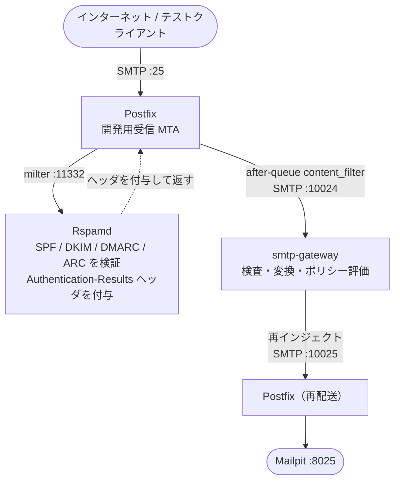

# 開発用 MTA の設定（Postfix + Rspamd）

`dev` プロファイルで起動する Postfix + Rspamd の設定方法を説明します。
これは**開発・動作確認専用**のコンポーネントです。

> **本番環境**: 同梱の Postfix は使用しないでください。
> 自前の MTA から smtp-gateway（port 10024）に転送するよう設定してください。
> 詳細は [自前 MTA との連携](./mta-self-managed.md) を参照。

---

## 構成の概要



設定ファイルは `examples/mta/` にあります。

---

## 環境変数

開発環境では `.env` に設定しなくてもデフォルト値で動作します。

```dotenv
# 受信するドメイン（デフォルト: internal.test）
MAILSHIELD_RELAY_DOMAINS=internal.test

# このMTAのホスト名（デフォルト: mail.internal.test）
MAILSHIELD_MTA_HOSTNAME=mail.internal.test
```

---

## Rspamd の役割と設定方針

同梱の Rspamd は **認証チェック専用** として設定されています。
スパム判定は smtp-gateway のワーカー層が担うため、Rspamd では行いません。

### 有効なモジュール

| モジュール | 役割 | Authentication-Results の値 |
|-----------|------|---------------------------|
| `spf` | SPF 検証 | `spf=pass/fail/softfail/none` |
| `dkim` | DKIM 署名検証 | `dkim=pass/fail/none` |
| `dmarc` | DMARC ポリシー検証 | `dmarc=pass/fail/none` |
| `arc` | ARC チェーン検証 | `arc=pass/fail/none` |

スコアリング系モジュール（rbl / neural / fuzzy_check / phishing 等）はすべて無効化されています。

---

## smtp-gateway が読む Authentication-Results ヘッダ

Rspamd が付与する `Authentication-Results` ヘッダは smtp-gateway が解析します。

```
Authentication-Results: mail.internal.test;
    spf=pass smtp.mailfrom=sender@external.test;
    dkim=none;
    dmarc=none;
    arc=none
```

smtp-gateway はこの値を `mail.auth_results.spf/dkim/dmarc/arc` として
ポリシーエンジンおよび Lua ワーカーに渡します。

---

## 起動

```bash
make dev-up
# = COMPOSE_PROFILES=infra,dev docker compose up -d
```

起動後の確認:

```bash
# Rspamd ヘルスチェック
docker compose exec rspamd rspamadm control stat

# Postfix キュー確認
docker compose exec postfix mailq

# テストメール送信
swaks --to test@internal.test --from sender@external.test \
      --server localhost --port 25 \
      --header "Subject: Hello MailShield"
```
