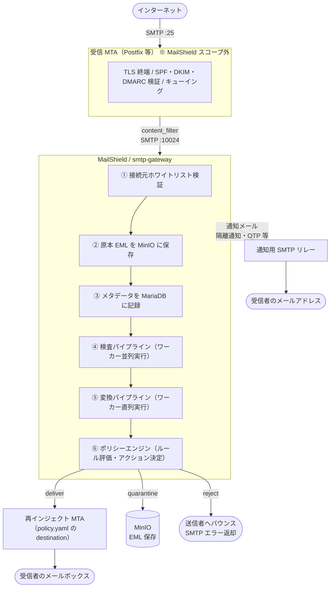
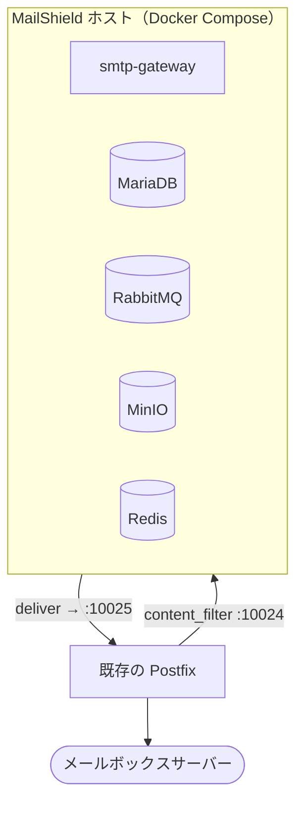
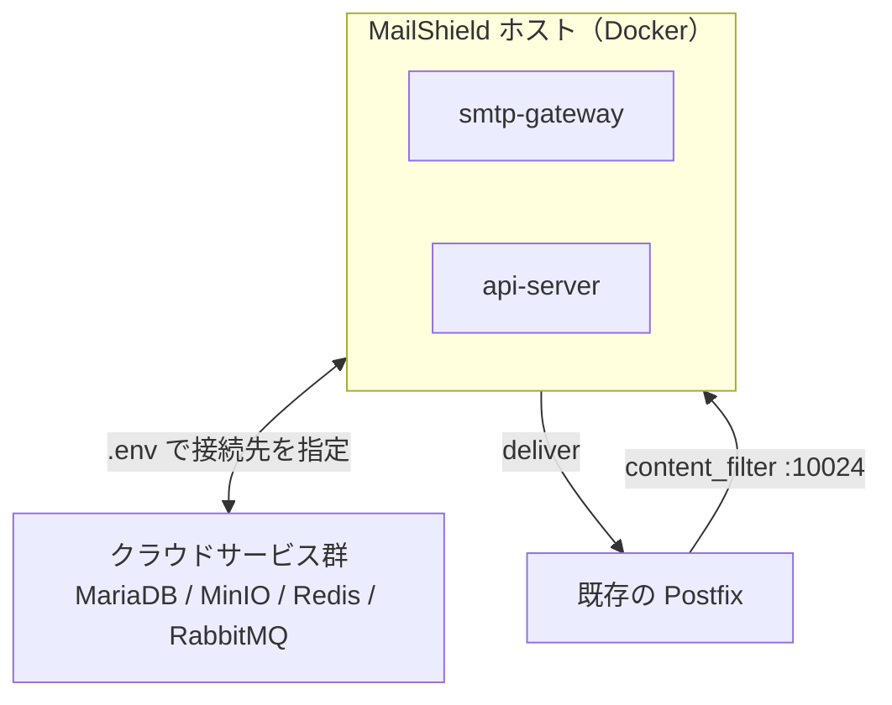

# システム概要と前提アーキテクチャ

セットアップを始める前に、このページを必ず読んでください。

---

## MailShield とは何か

MailShield は **SMTP after-queue content filter** です。

MTA（Postfix 等）が一度キューに受け付けたメールを受け取り、検査・変換・ポリシー評価を行ったうえで
配送・隔離・拒否を決定するミドルウェアです。

**MailShield が担うこと:**

- 受け取ったメールを S3 互換ストレージに保存する
- 設定したワーカー（ClamAV・Tika 等）でメールを検査する
- 設定した変換ワーカーでメールの内容を書き換える
- ポリシールールに従ってメールの配送・隔離・拒否を決定する
- 隔離されたメールを管理 Web UI で操作できるようにする

**MailShield が担わないこと:**

| 役割 | 担うコンポーネント |
|-----|-----------------|
| メールの受信（SMTP :25） | 受信 MTA（Postfix 等） |
| TLS 終端・キューイング | 受信 MTA |
| SPF / DKIM / DMARC 検証 | MTA または Rspamd（milter 連携） |
| 処理後メールの実際の配送 | 再インジェクト MTA |
| 通知メールの SMTP 配送 | 通知用 SMTP リレー |

---

## 全体アーキテクチャ図



---

## 必要な外部コンポーネント

### 必須

#### 1. 受信 MTA

インターネットから SMTP（port 25）でメールを受け取り、MailShield（port 10024）に転送する。

```
# Postfix の設定例（/etc/postfix/main.cf）
content_filter = smtp:[mailshield-host]:10024
```

MTA は `trusted_sources` として smtp-gateway のホワイトリストに追加する必要があります。
詳細は [自前 MTA との連携](./mta-self-managed.md) を参照。

#### 2. 同梱インフラ（Docker Compose オプションプロファイル）

MailShield が動作するために必要なインフラです。Docker Compose で同梱しているため、
自前で用意する必要はありません（外部サービスへの切り替えも可能）。

| コンポーネント | プロファイル | 役割 | ポート（デフォルト） |
|--------------|------------|------|------------------|
| **MariaDB** | _(なし・常時起動)_ | メールメタデータ・ユーザー・ポリシー・監査ログ | 3306 |
| **RabbitMQ** | `queue` | 外部システムへのイベント通知 | 5672 |
| **MinIO**（S3 互換） | `storage` | 原本 EML・処理済み EML・添付ファイルの保存 | 9000 |
| **Redis** | `api` | セッション・キャッシュ・レート制限 | 6379 |

MariaDB は唯一の必須サービスです。RabbitMQ・MinIO・Redis はそれぞれのプロファイルを
有効化した場合のみ起動します。外部サービスを使う場合は `.env` で接続先を切り替えられます。コードの変更は不要です。

### 必要なケースがある

#### 3. 再インジェクト MTA（deliver アクション時）

`deliver` アクションでメールを配送する際、smtp-gateway は `policy.yaml` の `destination`
に指定した SMTP エンドポイントへ直接接続します。

```yaml
# config/routes.d/10-inbound/policy.yaml
- name: default_deliver
  condition: "true"
  action: deliver
  destination: "smtp-relay.example.com:25"   # ← 再インジェクト先
```

**配送先の選択肢:**

| パターン | 説明 |
|---------|------|
| 受信 MTA の別ポート | Postfix の `10025` ポートなど、content_filter をバイパスするポートに再インジェクト |
| 別の SMTP リレー | 社内メールサーバー・クラウド SMTP リレーなど |
| 直接配送 | 外部 MX へ直接送信（MX ルックアップが必要な場合） |

> **注意**: 受信 MTA の `content_filter` 設定と同じポートに再インジェクトすると、
> MailShield に再度入ってしまう **ループ** が発生します。
> 必ずループを回避できるポートまたはホストを指定してください。

#### 4. 通知用 SMTP リレー

以下のケースでメールを送信します：

| ケース | 送信されるメール |
|-------|---------------|
| `quarantine` アクション決定時 | 受信者への隔離通知（Web UI ログインリンク付き） |
| 隔離メールの解放時（api-server） | 受信者への再配送通知 |
| 添付ファイル OTP ダウンロード | OTP コード付きメール |
| パスワードリセット | リセットリンク付きメール |

```yaml
# config/mailshield.yaml
notification:
  smtp_host: smtp-relay.example.com   # 通知用 SMTP リレーのホスト名
  smtp_port: 25
  from_address: noreply@example.com
```

> **注意**: 通知 SMTP も受信 MTA の `content_filter` ポートに送ると **ループ**します。
> 別のポートまたは別ホストを指定してください。

---

## 開発環境での構成

MailShield 自体は `make dev-up` で起動できます。
ただし MTA（受信・再インジェクト）は自前で用意する必要があります。

| 必要なコンポーネント | 対応方法 |
|-------------------|---------|
| 受信 MTA | **自前で用意する**（詳細: [MTA との連携](./mta-self-managed.md)） |
| 再インジェクト MTA | 同じ MTA の content_filter なしポート（通常 10025） |
| 通知用 SMTP リレー | Mailpit（`dev` プロファイル・port 1025）で代替可 |

```bash
make dev-up
# smtp-gateway + MariaDB + MinIO + RabbitMQ + Mailpit が起動する
# MTA は別途セットアップし、port 10024 に転送するよう設定すること

# テストメール送信（自前 MTA 経由）
swaks --to test@example.com --from sender@external.example \
      --server （MTA のホスト名） --port 25 \
      --header "Subject: Hello MailShield"

# 処理後メール確認（Mailpit に配送した場合）
open http://localhost:8025
```

---

## 本番環境の構成例

### 最小構成（Docker Compose + 既存 MTA）



### 外部インフラを使う構成



---

## 次のステップ

システム構成を確認したら、セットアップに進んでください。

- [クイックスタート](./quick-start.md) — Docker Compose で最速起動（開発環境）
- [自前 MTA との連携](./mta-self-managed.md) — 既存 MTA への組み込み方法
- [プロファイルガイド](./profiles.md) — 起動するコンポーネントの選択方法
