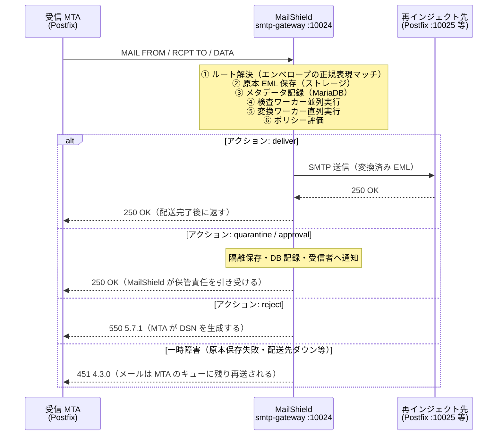
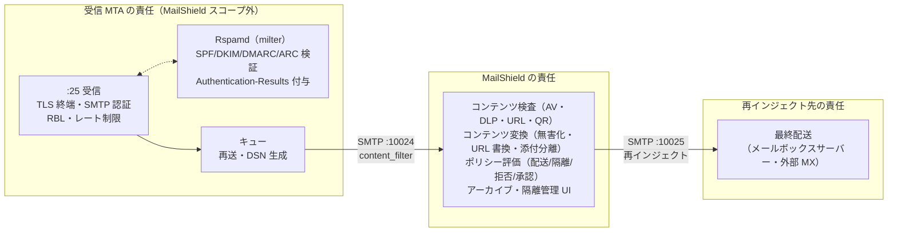
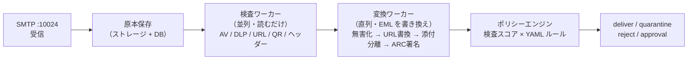

# システム概要と前提アーキテクチャ

MailShield がメールフローのどこに位置し、SMTP レベルでどう振る舞い、MTA との間でどう責任を分担するかを説明する。**セットアップを始める前に必ず読むこと。**

| 項目 | 内容 |
|------|------|
| 対象読者 | MailShield の導入を検討・計画しているメールシステム管理者 |
| 前提知識 | SMTP・MTA（Postfix 等）・メール認証（SPF / DKIM / DMARC）の基礎 |

---

## MailShield とは

MailShield は **after-queue content filter** である。amavisd-new と同じ配置で動作する独立した SMTP デーモンであり、MTA が一度キューに受け付けたメールを SMTP で受け取り、検査・変換・ポリシー評価を行ったうえで、その結果を SMTP 応答コードとして MTA に返す。

```
外部 → [受信 MTA] → キュー → [MailShield :10024] → [再インジェクト :10025] → 最終配送
                                     │
                                     └─ 隔離 / 拒否 / 承認保留
```

設計上の重要な性質が 3 つある。

1. **キューを持たない。** メールの永続キューは受信 MTA のキューだけである。MailShield は受け取ったメールを処理し終えるまで（配送完了・隔離確定・拒否確定まで）SMTP 応答を返さない。処理に失敗すれば `451` を返し、メールは MTA のキューに残って再送される。**MailShield がクラッシュしてもメールは消失しない。**
2. **バウンスを生成しない。** 拒否は `550` 応答で MTA に伝え、DSN（バウンスメール）の生成は MTA に任せる。
3. **メール認証を検証しない。** SPF / DKIM / DMARC / ARC の検証は前段（Rspamd 等の milter）が行い、MailShield はその結果が書かれた `Authentication-Results` ヘッダーを**読むだけ**である。

---

## SMTP レベルの動作

メール技術者にとって最も重要なのは「DATA に対して何をいつ返すか」である。MailShield は **DATA トランザクションの中で全処理を同期実行**し、結果を応答コードで返す。



### 応答コードの意味

| 応答 | 条件 | その後の責任 |
|------|------|-------------|
| `250` | 配送完了、または隔離・承認保留として保管完了 | MailShield（隔離の場合）または再インジェクト先 |
| `451 4.3.0` | 原本 EML の保存失敗・配送先 MTA への接続失敗など一時障害 | 受信 MTA（キューに残して再送） |
| `550 5.7.1` | ポリシーによる拒否（`action: reject`） | 受信 MTA（DSN 生成） |
| `550 5.7.0` | 設定エラー（マッチするルートまたはポリシールールがない） | 受信 MTA（DSN 生成）。設定を修正すること |
| `550 5.7.0 Access denied` | `trusted_sources` にない接続元 | 接続拒否（セッション確立時） |
| `552 5.3.4` | `max_message_size_mb` 超過 | 受信 MTA |

### タイムアウトの整合

処理は DATA 応答を返すまで同期で行われるため、**MailShield の処理時間だけ MTA 側の SMTP セッションが延びる**。以下の整合を取ること。

| 設定 | デフォルト | 条件 |
|------|-----------|------|
| MailShield `handler_timeout_seconds` | 60 秒 | 最も遅いワーカーの `timeout_seconds` より大きくする |
| Postfix `smtp_data_done_timeout` | 600 秒 | `handler_timeout_seconds` より大きければ問題ない（デフォルトで十分） |
| Postfix `message_size_limit` | 10MB | MailShield `max_message_size_mb`（デフォルト 50MB）と合わせる |

---

## 責任分担

各コンポーネントの責任範囲を明確にする。**MailShield は「キューの後ろ・最終配送の前」だけを担う。**



### 機能別の担当表

| 機能 | 担当 | MailShield の関与 |
|------|------|------------------|
| インターネットからの受信（:25）・MX | 受信 MTA | なし（MailShield は MX にならない） |
| TLS 終端・SMTP 認証・RBL・グレイリスト | 受信 MTA | なし |
| SPF / DKIM / DMARC / ARC **検証** | Rspamd（milter） | `Authentication-Results` を読み取ってスコアリングに利用 |
| キューイング・再送・DSN 生成 | 受信 MTA | なし（応答コードで指示するのみ） |
| コンテンツ検査（ウイルス・DLP・URL・QR・なりすまし） | **MailShield** | 検査ワーカー |
| コンテンツ変換（HTML 無害化・URL 書換・添付分離・免責文・ARC **署名**） | **MailShield** | 変換ワーカー |
| 配送 / 隔離 / 拒否 / 承認保留の決定 | **MailShield** | ポリシーエンジン（YAML ルール） |
| 原本・処理済み EML のアーカイブ | **MailShield** | ストレージに常時保存 |
| 隔離メールの管理・解放 | **MailShield** | Web UI / REST API（api-server） |
| 最終配送（メールボックス・外部 MX） | 再インジェクト先 MTA | なし |
| 通知メール（隔離通知・OTP 等）の SMTP 配送 | 通知用 SMTP リレー | 生成のみ（配送はリレーに委ねる） |

---

## 内部アーキテクチャ

MailShield 内部の処理は単一プロセス（smtp-gateway）内で完結する。



設計判断とその理由:

| 設計 | 理由 |
|------|------|
| ワーカーはすべて **in-process（goroutine）** で実行する | ワーカー間のキュー・RPC をなくし、1 通の処理を 1 つの SMTP トランザクション内で完結させるため。ワーカー障害は当該ワーカーのスキップ（検査）または隔離（変換）として即時に応答へ反映される |
| 検査ワーカーは**並列**・変換ワーカーは**直列** | 検査は EML を読むだけで相互に独立。変換は前段の出力が次段の入力になるため順序が意味を持つ（例: 無害化してから ARC 署名） |
| イベント通知は**メールフローに介在しない** | `mail.received` の外部通知（SIEM 連携等）は webhook で行う（オプション・`events.backend: webhook`）。通知先が停止してもメールフローは影響を受けない |
| ストレージ / MariaDB は**記録・管理用** | 配送はメモリ上の EML をそのまま SMTP 送信する。ストレージは原本アーカイブと隔離解放・Web UI のために使う。原本保存の失敗だけは `451` を返す（証跡なしで配送しないため） |
| ルートは**エンベロープ**（MAIL FROM / RCPT TO）で決まる | `routes.d/` の正規表現に最初にマッチしたルートのワーカー・ポリシーが適用される。受信（inbound）と送信（outbound）を同一インスタンスで処理できる |

各コンポーネントの詳細は [アーキテクチャ概要](../architecture.md)、処理ステップの仕様は [メール処理フロー](../specs/mail-processing-flow.md) を参照。

---

## MTA との連携方法

受信 MTA（Postfix）とは **5 つの接続点**を設定する。具体的な設定例は [MTA との連携](./mta-self-managed.md) を参照。

| # | 接続点 | 設定場所 | 内容 |
|---|-------|---------|------|
| 1 | content_filter | Postfix `main.cf` | `content_filter = smtp:[<mailshield-host>]:10024` — キュー投入後の全メールを MailShield へ転送する |
| 2 | 再インジェクトポート | Postfix `master.cf` | `10025 inet ... -o content_filter=` — 処理済みメールを受け取る専用ポート。**content_filter と milter を必ず外す**（ループ・二重処理防止） |
| 3 | 接続元制限 | MailShield `mailshield.yaml` | `server.trusted_sources` に受信 MTA の IP を登録する。それ以外の接続は SMTP セッション確立時に拒否される |
| 4 | 配送先 | MailShield `reinject` / `policy.yaml` | `deliver` アクションの宛先を再インジェクトポート（#2）に向ける |
| 5 | 通知 SMTP | MailShield `notification` | 隔離通知・OTP 等のシステムメールの送信先。content_filter を通らない経路を指定する |

> [!WARNING]
> **ループ防止が最重要である。** 配送先（#4）・通知先（#5）のいずれかを content_filter が有効なポート（#1 と同じ受け口）に向けると、`MTA → MailShield → MTA → MailShield → …` のメールループが発生する。再インジェクト・通知は必ず content_filter なしのポートまたは別ホストへ送ること。

> [!NOTE]
> MailShield と受信 MTA の間は認証なし・TLS なしの SMTP である（`trusted_sources` による接続元 IP 制限のみ）。両者は同一ホストまたは信頼できる内部セグメントに配置すること。

### 認証結果の受け渡し

MailShield のヘッダー検査ワーカー（なりすまし検知）とポリシーは、前段が付与した `Authentication-Results` ヘッダーに依存する。Rspamd を milter として Postfix に接続し、検証結果をヘッダーに書き込む構成を推奨する。ヘッダーがない場合、SPF / DKIM / DMARC はすべて `none` として扱われる（エラーにはならない）。

```
Authentication-Results: mta.example.com;
    spf=pass smtp.mailfrom=sender@external.example;
    dkim=pass header.d=external.example;
    dmarc=pass header.from=external.example
```

---

## 配置パターン

### パターン A: 受信 MTA と同居（最小・推奨開始点）

```
┌─ 1 台のホスト ─────────────────────────────────┐
│  Postfix(:25) ─ content_filter → MailShield(:10024)  │
│       ↑ :10025 ←──────── deliver ────────┘          │
│  Postfix ─ transport_maps → 最終 MTA                 │
└──────────────────────────────────────────────┘
```

`trusted_sources: [127.0.0.1]` だけで済み、ネットワーク要件が最も単純。

### パターン B: MailShield を分離

受信 MTA と MailShield を別ホスト（または別コンテナホスト）に分ける。スケール・保守を独立させたい場合に選ぶ。`trusted_sources` に MTA の IP を、Postfix の content_filter に MailShield のホストを相互に設定する。

### パターン C: 送信メールも通す

社内 → 外部の送信メール（DLP・免責文付与・承認フロー）も同一インスタンスで処理できる。submission（:587）で受けたメールも content_filter で MailShield に通し、`routes.d/20-outbound/`（MAIL FROM が自組織ドメイン）のルートで処理する。受信と送信はエンベロープの正規表現マッチで自動的に振り分けられる。

### インフラの選択

必須の外部サービスは **MariaDB のみ**。他はすべて設定で代替できる。

| コンポーネント | 用途 | 省略する場合の設定 |
|--------------|------|------------------|
| MariaDB | メタデータ・隔離管理・ユーザー | **必須** |
| MinIO / S3 | EML・添付ファイルの保存 | `storage.backend: filesystem`（ローカル FS に保存） |
| Redis | api-server のセッション | `redis.backend: mariadb` |

---

## システム要件

### ソフトウェア要件

| 構成 | 必要なソフトウェア |
|------|------------------|
| Docker Compose 構成 | Docker Engine 24.0 以上・Docker Compose v2.20 以上・GNU Make |
| バイナリ構成（ビルド） | Go 1.24 以上・Node.js 20 以上（Web UI を使う場合） |
| 共通（インフラ） | MariaDB 11.x（**必須**）。MinIO / Redis 7+ はオプション |

### リソースの目安

| 構成 | CPU | メモリ | ディスク |
|------|-----|-------|---------|
| 最小構成（smtp-gateway + MariaDB） | 2 コア | 2 GB | 20 GB〜（EML アーカイブ量に依存） |
| 標準構成（+ MinIO / api-server） | 4 コア | 4 GB | 50 GB〜 |
| スキャナー込み（+ ClamAV / Tika） | 4 コア以上 | 8 GB 以上 | +10 GB（ClamAV 定義 DB 等） |

> [!NOTE]
> EML はすべてアーカイブされるため、ディスク使用量はメール流量に比例して増加する。平均メールサイズ × 日次流量 × 保持期間で見積もること。

### 使用ポート

| ポート | コンポーネント | 方向 | 説明 |
|-------|--------------|------|------|
| 10024/tcp | smtp-gateway | 受信 MTA → MailShield | content_filter の転送先。`trusted_sources` で接続元を制限する |
| 8080/tcp | smtp-gateway | 管理者 → MailShield | ヘルスチェック・`/simulate`。外部公開しないこと |
| 8090/tcp | api-server | Web UI → API | REST API |
| 3000/tcp | Web UI | ブラウザ → UI | 管理画面 |
| 10025/tcp（例） | 受信 MTA | MailShield → MTA | 再インジェクト受付（content_filter なしポート） |

---

## 次のステップ

| 目的 | ドキュメント |
|------|------------|
| まず動かして評価する（MTA 不要・約 15 分） | [クイックスタート](./quick-start.md) |
| 受信 MTA（Postfix + Rspamd）を構築する | [MTA との連携](./mta-self-managed.md) |
| MailShield 本体を設定して本番導入する | [MailShield 設定ガイド](./mailshield-config.md) |
| 起動するコンポーネントを選ぶ | [Docker Compose プロファイル](./profiles.md) |
