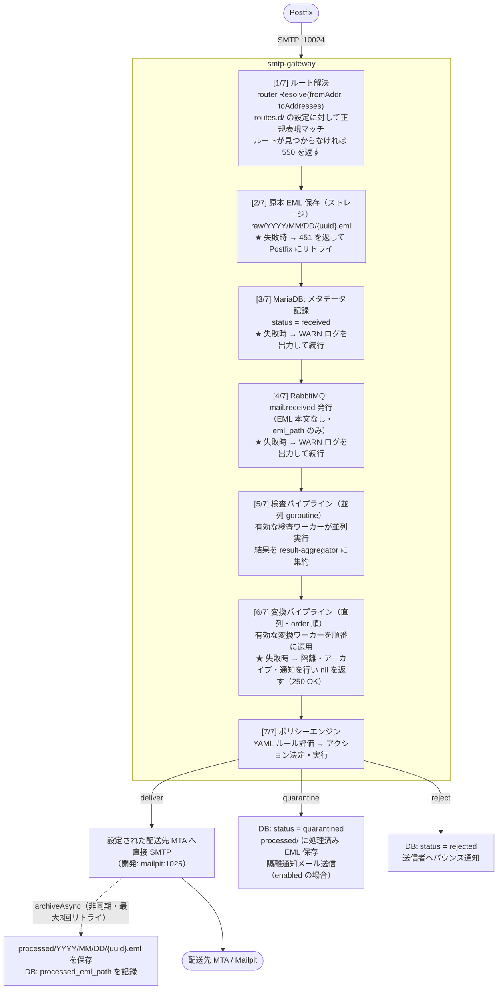
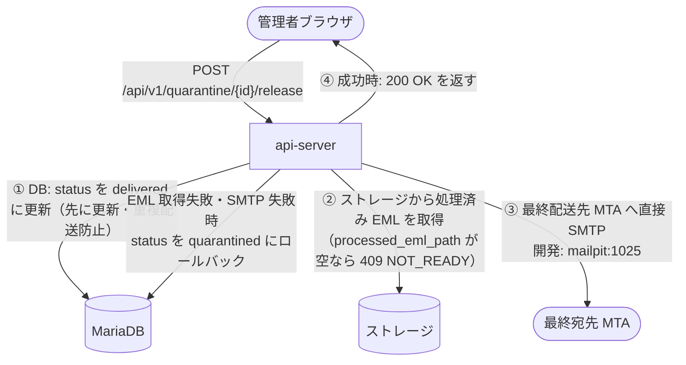
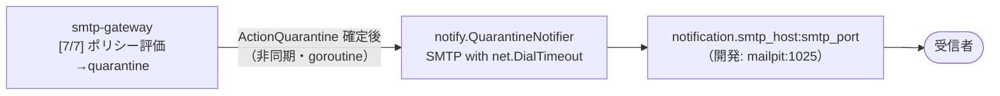

# メール処理フロー

最終更新: 2026-06-30

---

## ポート・コンポーネント対応表

| コンポーネント | ポート | 役割 | 外部公開 |
|-------------|-------|------|--------|
| Postfix | :25 | 外部からの受信 | ✓ |
| Postfix-submission | :587 | 内部ユーザーからの送信 | ✓ |
| smtp-gateway | :10024 | Postfix の content filter 受付（inbound / outbound 共通） | ✗（Docker 内） |
| smtp-gateway | :8080 | ヘルスチェック・`/simulate` エンドポイント | ✓ |
| api-server | :8090 | REST API | ✓ |
| Web UI | :3000 | 管理画面 | ✓ |

---

## HandleMail の 7 ステップ

smtp-gateway が Postfix から SMTP セッションを受け取ると、以下の順序で処理する。

---

## ルート解決（[1/7]）

テナントテーブルによる解決は行わない。`routes.d/` ディレクトリに配置した YAML ファイルに定義されたルートに対して、MAIL FROM アドレスおよび RCPT TO アドレスを正規表現でマッチさせる。

- マッチしたルートの `direction:` フィールド（`inbound` / `outbound`）がメールの方向を決定する
- テナント情報はルート設定から取得する（`tenants` テーブルを参照しない）
- どのルートにもマッチしない場合は `550` を返す

---

## 変換パイプライン失敗時の動作（[6/7]）

変換パイプラインでエラーが発生した場合、変換前のメールで処理を続行するのではなく、以下の手順で安全に処理を打ち切る。

1. メールを**隔離**する（DB: `status = quarantined`、ストレージに EML を保存）
2. アーカイブ処理を実行する
3. 設定に従い隔離通知メールを送信する
4. smtp-gateway は Postfix に `250 OK` を返す（メールをキューに残さない）

---

## inbound / outbound の判定

inbound と outbound の区別はテナントテーブルの参照では行わない。ルート解決（[1/7]）で取得したルートの `direction:` フィールドによって決まる。ポリシーエンジンは方向に応じたルートの `policy.yaml`（`config/routes.d/<ルート名>/policy.yaml`）を読み込む。

---

## /simulate エンドポイント

smtp-gateway のヘルスポート（`:8080`）には `/simulate` エンドポイントが存在する。

| 項目 | 内容 |
|-----|------|
| メソッド | `POST` |
| Content-Type | `message/rfc822`（生 EML を直接 POST） |
| レスポンス | パイプライン全体の処理結果を JSON で返す |
| 副作用 | 実際の配送・保存・DB 書き込みは行わない |

テスト・デバッグ用途で使用する。CI でのルール検証や、本番環境に影響を与えずにポリシー動作を確認する際に利用できる。

---

## 隔離解放フロー

**重複配送防止:** DB を先に `delivered` に更新することで、解放リクエストが二重に来た場合も2回目は `GetQuarantine`（`status=quarantined` のみ返す）が 404 を返して防止できる。

---

## 隔離即時通知フロー

- `quarantine_notification.enabled: false` の場合は送信しない
- 各受信者（To: アドレス）に1通ずつ送信する
- 送信失敗はログに記録して無視する（best-effort）
- 通知メールには `{ui_base_url}/quarantine` へのログインリンクを含む

---

## 通知メールフロー（OTP・パスワードリセットなど）

api-server が新規生成するメール（OTP コード・パスワードリセット）は `notification.smtp_host:smtp_port` へ直接 SMTP 送信する。

---

## ストレージ対応表

| 用途 | バケット | パス |
|------|---------|------|
| 原本 EML | `mailshield-eml` | `raw/YYYY/MM/DD/{uuid}.eml` |
| 処理済み EML（deliver・quarantine 共通） | `mailshield-eml` | `processed/YYYY/MM/DD/{uuid}.eml` |
| 分離済み添付ファイル | `mailshield-attachments` | `attachments/{message_uuid}/{filename}` |

ストレージバックエンドは `minio`（デフォルト）・`s3`・`filesystem` から設定で選択できる。

---

## エラー時の挙動

| ステップ | エラー時の動作 |
|---------|-------------|
| [1/7] ルート解決失敗 | `550` を返す |
| [2/7] ストレージ保存失敗 | `451` を返して Postfix にリトライさせる |
| [3/7] DB 記録失敗 | WARN ログを出力して続行 |
| [4/7] RabbitMQ 発行失敗 | WARN ログを出力して続行（メールフローに影響しない） |
| [5/7] 検査ワーカーエラー | そのワーカーをスキップして続行 |
| [6/7] 変換ワーカーエラー | メールを隔離・アーカイブ・通知して `nil` を返す（250 OK） |
| [7/7] ポリシー実行失敗 | `451` を返して Postfix にリトライさせる |
| archiveAsync 失敗 | 最大3回リトライ（2s/4s バックオフ）。全失敗時は ERROR ログで手動対応を促す |
| 隔離即時通知送信失敗 | WARN ログに記録して無視（best-effort） |
| 隔離解放: ストレージ取得失敗 | `rollbackToQuarantined` で DB を元に戻す。409 NOT_READY を返す |
| 隔離解放: SMTP 送信失敗 | `rollbackToQuarantined` で DB を元に戻す。500 を返す |
