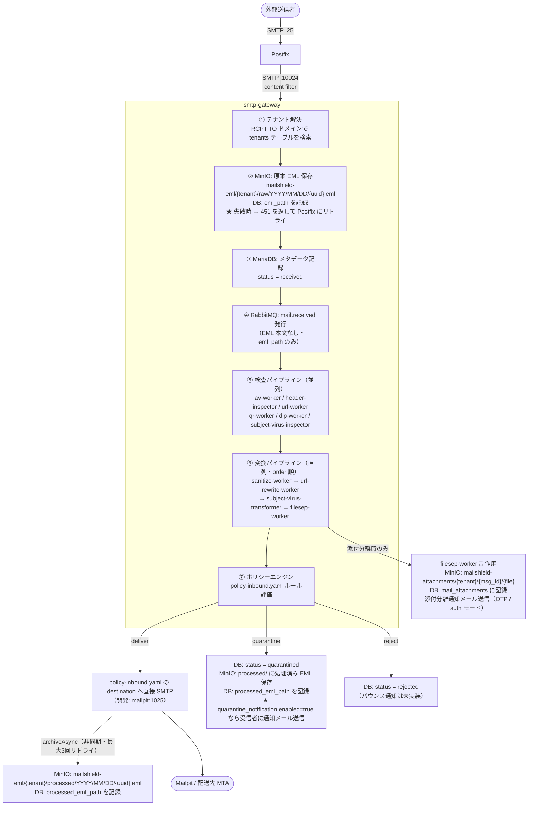
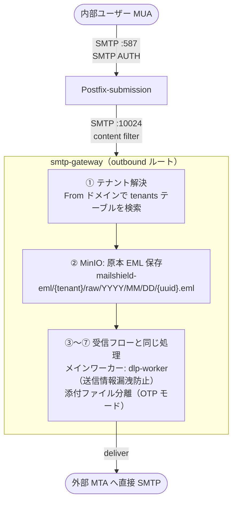
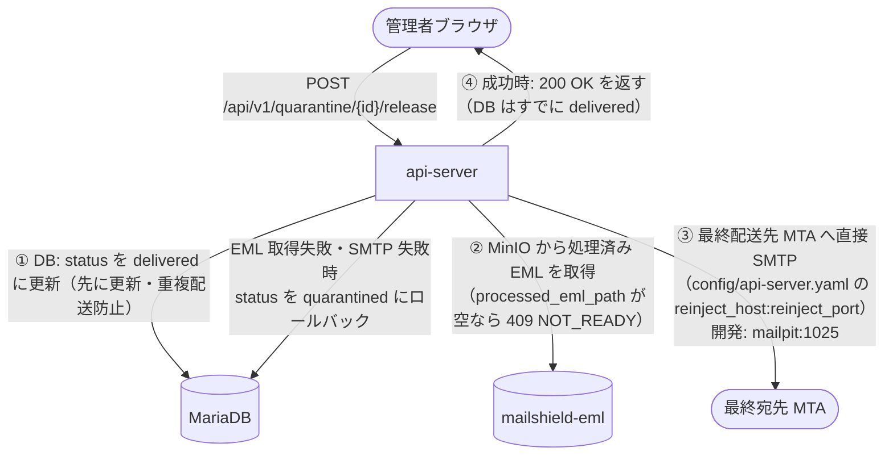
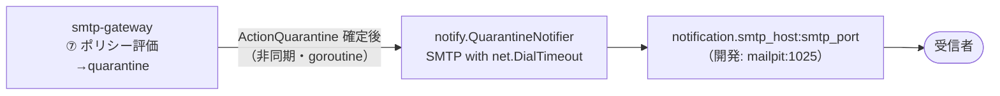
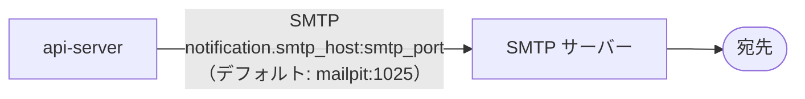

# メール処理フロー

最終更新: 2026-06-15

---

## ポート・コンポーネント対応表

| コンポーネント | ポート | 役割 | 外部公開 |
|-------------|-------|------|--------|
| Postfix | :25 | 外部からの受信 | ✓ |
| Postfix | :10025 | after-queue content filter 用再インジェクト受付（現在未使用） | ✗（Docker 内） |
| Postfix-submission | :587 | 内部ユーザーからの送信 | ✓ |
| smtp-gateway | :10024 | Postfix の inbound content filter 受付 | ✗（Docker 内） |
| smtp-gateway | :10024 | Postfix-submission の outbound content filter 受付 | ✗（Docker 内） |
| smtp-gateway | :8080 | ヘルスチェック | ✓ |
| api-server | :8090 | REST API | ✓ |
| Web UI | :3000 | 管理画面 | ✓ |

---

## 受信メールフロー（inbound ルート）

---

## 送信メールフロー（outbound ルート）

---

## 隔離解放フロー

**重複配送防止:** DB を先に `delivered` に更新することで、解放リクエストが二重に来た場合も2回目は `GetQuarantine`（`status=quarantined` のみ返す）が 404 を返して防止できる。

---

## 隔離即時通知フロー

- `quarantine_notification.enabled: false` の場合は送信しない
- 各受信者（To: アドレス）に1通ずつ送信する
- 送信失敗はログに記録して無視する（best-effort）
- 通知メールには `{ui_base_url}/quarantine` へのログインリンクを含む

---

## 通知メールフロー（OTP・パスワードリセットなど）

api-server が新規生成するメール（OTP コード・パスワードリセット）は `notification.smtp_host:smtp_port` へ直接 SMTP 送信する。

---

## ストレージ対応表

| 用途 | バケット | パス |
|------|---------|------|
| 原本 EML | `mailshield-eml` | `{tenant}/raw/YYYY/MM/DD/{uuid}.eml` |
| 処理済み EML（deliver・quarantine 共通） | `mailshield-eml` | `{tenant}/processed/YYYY/MM/DD/{uuid}.eml` |
| 分離済み添付ファイル | `mailshield-attachments` | `{tenant}/{message_uuid}/{filename}` |

---

## エラー時の挙動

| ステップ | エラー時の動作 |
|---------|-------------|
| ② MinIO 原本保存失敗 | `451` を返して Postfix にリトライさせる |
| ③ DB 記録失敗 | ログを出力して続行 |
| ④ RabbitMQ 発行失敗 | ログを出力して続行 |
| ⑤ 検査ワーカーエラー | そのワーカーをスキップして続行 |
| ⑥ 変換ワーカーエラー | 変換前のメールで続行 |
| ⑦ ポリシー実行失敗 | `451` を返して Postfix にリトライさせる |
| archiveAsync 失敗 | 最大3回リトライ（2s/4s バックオフ）。全失敗時は ERROR ログで手動対応を促す |
| 隔離即時通知送信失敗 | WARN ログに記録して無視（best-effort） |
| 隔離解放: MinIO 取得失敗 | `rollbackToQuarantined` で DB を元に戻す。409 NOT_READY を返す |
| 隔離解放: SMTP 送信失敗 | `rollbackToQuarantined` で DB を元に戻す。500 を返す |
